To use mermaid, you must provide a markdown code block with valid MermaidJS syntax.

For example:

```mermaid
graph TD
    A[Inicio] --> B[Evaluar idea]
    B -->|Idea viable| C[Planificar proyecto]
    B -->|Idea no viable| D[Descartar idea]
    C --> E[Desarrollo]
    E --> F[Testeo]
    F -->|Pruebas exitosas| G[Implementación]
    F -->|Pruebas fallidas| E
    G --> H[Fin]
```



## RULES:

- Never add parenthesis inside [ ] because it will break the mermaid syntax and throw an error, use a different approach instead of parenthesis.
- This is an example ERROR:

```mermaid
graph TD
    A[Inicio] --> B[Reunir ingredientes]
    B --> C[Preparar arroz (100g)]
```

In the second line, the parenthesis will break the mermaid syntax and throw an error, so, NEVER add parenthesis inside [ ].

