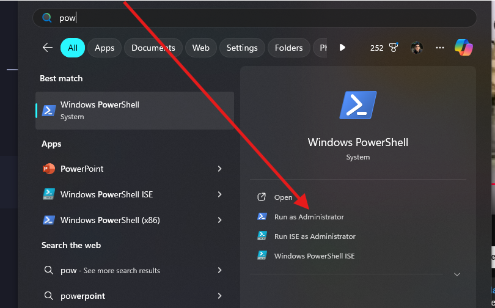
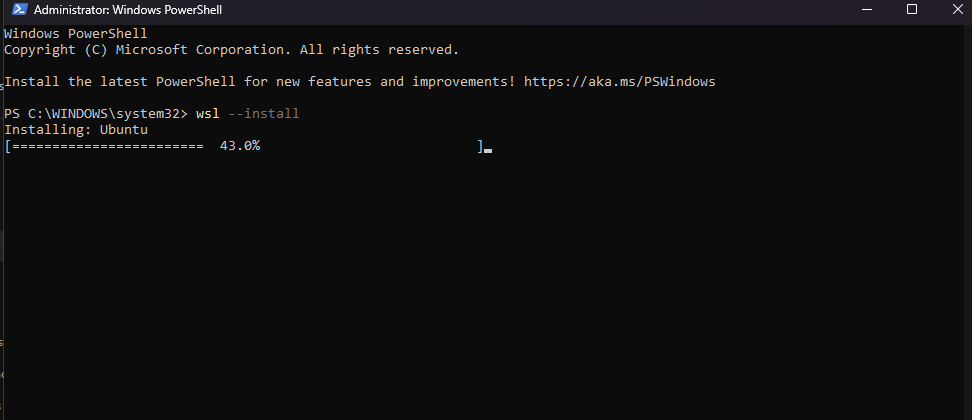
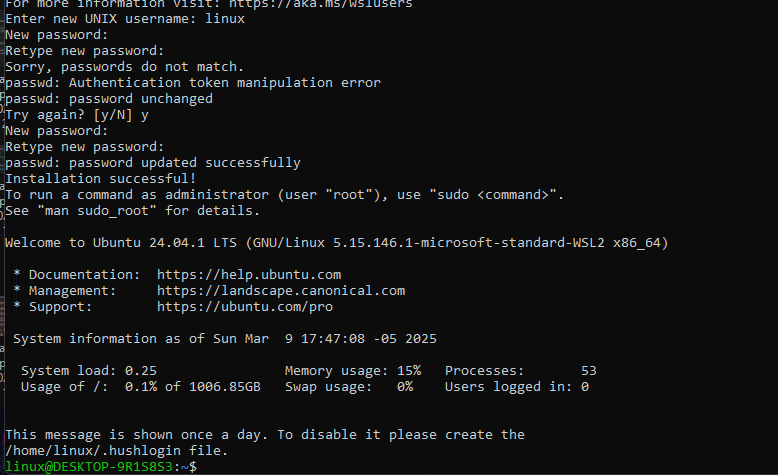

# 📌 Instalación de Herramientas Esenciales Masscer en Windows

Para que Masscer pueda funcionar, se necesitan instalar ciertos lenguages de programación, herramientas de desarrollo, de conversión de documentos, una base de datos vectorial, base de datos normal. La creación de contenedores y configuración del proyecto se hace en base comandos, sin embargo, antes de usar esos comandos, se necesitan instalar ciertas herramientas para poder usarlos. También, antes de instalar Docker, se necesita instalar WSL (Windows Subsystem for Linux).

## Lenguages de programación y desarrollo

### 1️⃣ **WSL (Windows Subsystem for Linux)**

WSL es una herramienta que permite ejecutar sistemas operativos Linux en Windows.

🔗 [Descargar WSL](https://learn.microsoft.com/en-us/windows/wsl/install)

1. Abrir una PowerShell como administrador.
   
2. Ejecutar el siguiente comando:

   ```bash
   wsl --install
   ```

   Esto inicializa el proceso de instalación de WSL.
   

3. Add an user name and password to the WSL.
   

4. Reiniciar la PC.

### 2️⃣ **Docker**

Docker es una herramienta que permite ejecutar contenedores dentro de un sistema operativo. Un contenedor es una aplicación encapsulada para que funcione sobre la infraestructura de Docker.

1. 🔗 [Descargar Docker para Windows AMD 64 y seguir las instrucciones](https://www.docker.com/get-started/)

### 3️⃣ **Python con Pyenv**

Pyenv es una herramienta que permite instalar y administrar múltiples versiones de Python. De esta forma podemos instalar la versión que necesitemos para el proyecto.

1. Abrir una PowerShell como administrador.

```bash
Invoke-WebRequest -UseBasicParsing -Uri "https://raw.githubusercontent.com/pyenv-win/pyenv-win/master/pyenv-win/install-pyenv-win.ps1" -OutFile "./install-pyenv-win.ps1"; &"./install-pyenv-win.ps1"
```

> NOTA: En caso de dar un error, un modelo como GPT-4o puede ayudarte a solucionar el problema, será cuestión de correr otro comando para desactivar algo en Windows.

2. Instalar Python 3.12.7

```bash
pyenv install 3.12.7
```

3. Hacer que Pyenv use la versión 3.12.8

```bash
pyenv global 3.12.7
```

4. Verificar la instalación de Python
   Abre una terminal y escribe:

```bash
python --version
```

### 4. Node.js LTS

NodeJs permite ejecutar JavaScript en el servidor. Esto es muy útil para el desarrollo de aplicaciones web.

- Ir a [node.js.org](https://nodejs.org/es) y descargar la versión LTS.
- Ejecutar el instalador.
- Verificar la instalación de Node.js
  ```bash
  node --version
  ```

### 5. Git

Git es una herramienta de control de versiones. Esto es muy útil para el desarrollo de aplicaciones web.

- Ir a [git-scm.com](https://git-scm.com/) y descargar el instalador.
- Ejecutar el instalador.
- Verificar la instalación de Git

```bash
git --version
```

### 6️⃣ **Ollama** (IA Local)

Ollama es una herramienta que te permite ejecutar modelos de IA en tu computadora.

- 🔗 [Descargar Ollama para Windows](https://ollama.com/download)
- Ejecutar el instalador.
- Verificar la instalación de Ollama

```bash
ollama --version
```

### 7️⃣ **Visual C++ Build Tools**

🔗 [Descargar](https://visualstudio.microsoft.com/es/visual-cpp-build-tools/)

1. Descarga e instala **Build Tools for Visual Studio**.
2. Asegúrate de incluir **C++ build tools** (Pesa aproximadamente 7GB).
3. Presiona el botón de "Instalar" y espera a que termine la instalación.

### 8️⃣ **VSCode**

VSCode es un editor de código fuente, en él se pueden editar los archivos de código de la aplicación.
🔗 [Descargar](https://code.visualstudio.com/download)

1. Descargar el instalador para tu sistema operativo.
2. Ejecutar el instalador.
3. Asegurarse de marcar las casillas para agregar el comando `code` a la ruta de tu sistema operativo. Agregar un ícono a tu escritorio. Y todas las demás de esta sección.

## Herramientas de conversión

### 1️⃣ **Pandoc** (Conversión de Documentos)

Pandoc es una herramienta de conversión de documentos
, permite convertir entre distintos formatos, por ejemplo: de HTML a PDF, de Markdown a HTML, de Markdown a PDF, etc.

- Ir a [Links de descarga de Pandoc](https://github.com/jgm/pandoc/releases/tag/3.6.3)
- Descargar el instalador para tu sistema operativo. Si estás en Windows, descarga el archivo `.msi`.
- Ejecutar el instalador.
- Verificar la instalación de Pandoc

```bash
pandoc --version
```

---

### 2️⃣ **MiKTeX** (Para LaTeX)

MiKTeX es una herramienta de procesamiento de texto que permite crear documentos en LaTeX. LaTeX es un sistema de composición de textos que permite crear documentos con fórmulas matemáticas, gráficos, etc. Esta herramienta la usa Pandoc para convertir documentos a PDF.
🔗 [Descargar MiKTeX](https://miktex.org/download)

1. Ve al enlace y descarga el instalador para tu sistema operativo.
2. Sigue las instrucciones del asistente de instalación.
3. Asegúrate de marcar la opción de "Install missing packages on-the-fly".
4. ¡Listo! Puedes probar con `pdflatex --version` en la terminal.

---

## 4️⃣ **FFmpeg** (Multimedia)

FFmpeg es una herramienta de procesamiento de multimedia. Con ella se puede hacer uso de los dispositivos de audio de la computadora para reproducir audios. También permita la conversión de formatos de audio.

- Abre una terminal de PowerShell como administrador.
- Ejecuta el siguiente comando:

```powershell
winget install "FFmpeg (Essentials Build)"
```

Para verificar:

```bash
ffmpeg -version
```

> Una vez llegaste hasta acá, ya todos los requerimientos estarán instalados en la computadora, y habría que configurar la aplicación.

Sigue los pasos de [configuración](./setup.md) para que puedas usar la aplicación.
